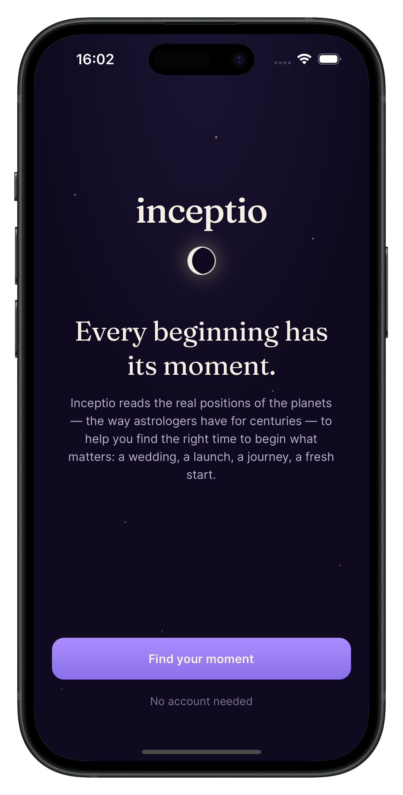
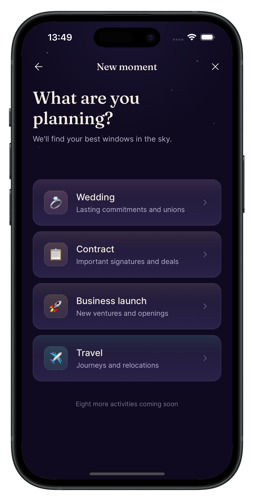
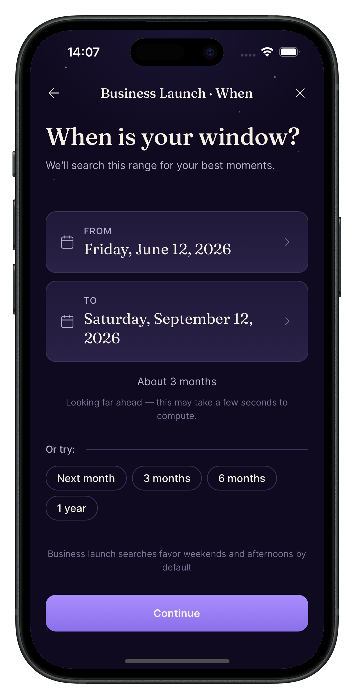
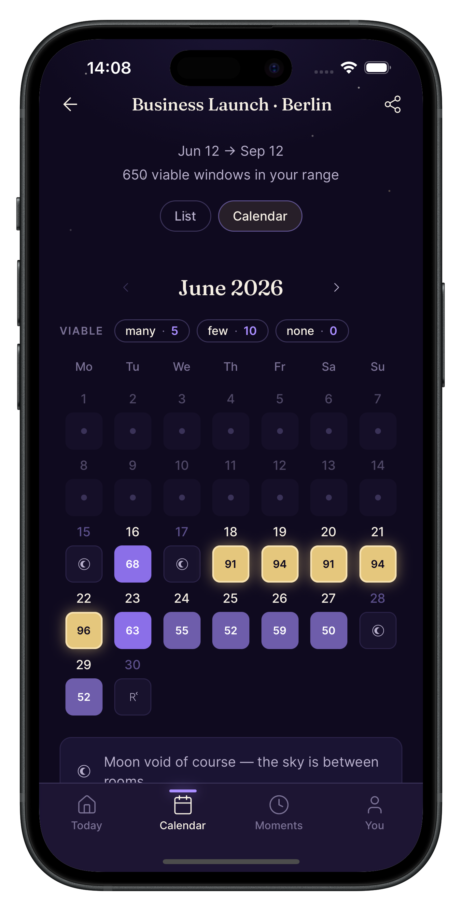
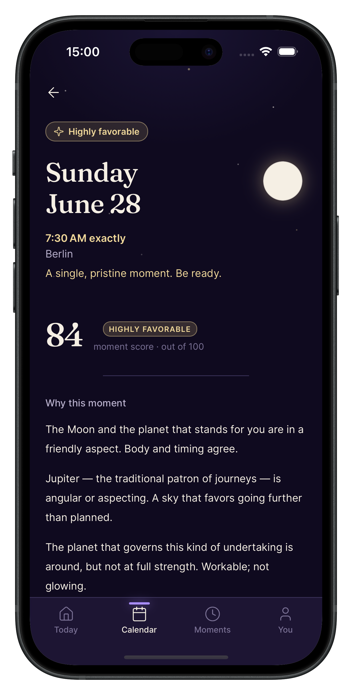
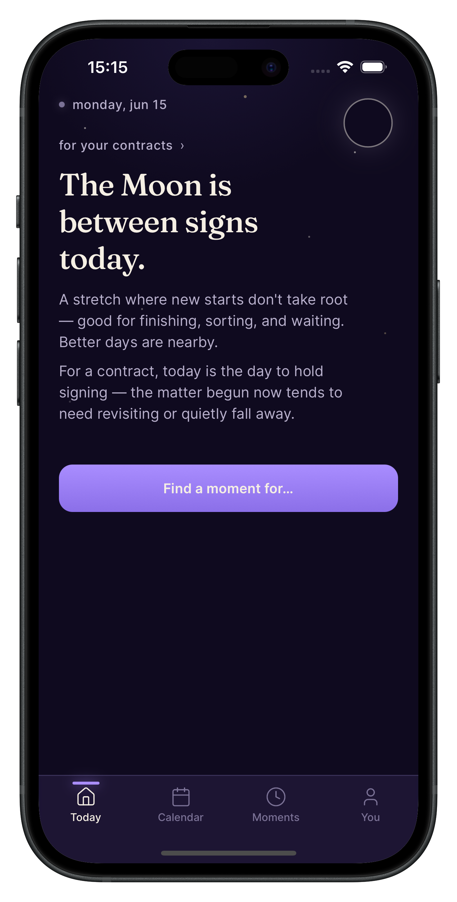
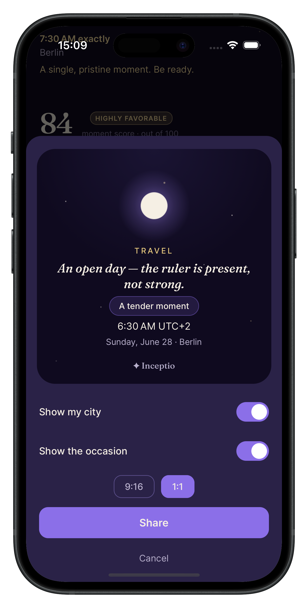
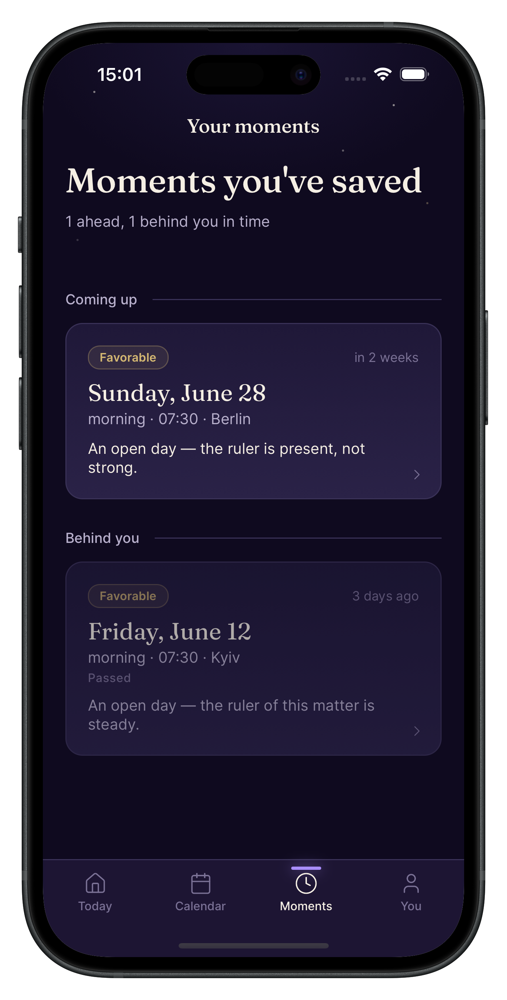

# Inceptio

A mobile app for choosing astrologically favorable moments to begin important events — weddings, contract signings, business launches, travel.

Built on [astrology-api.io](https://astrology-api.io) v3 electional endpoint.

## Screenshots

<table>
  <tr>
    <td align="center"><b>Onboarding</b></td>
    <td align="center"><b>Find your activity</b></td>
    <td align="center"><b>Find your moment</b></td>
    <td align="center"><b>Calendar</b></td>
  </tr>
  <tr>
    <td align="center"></td>
    <td align="center"></td>
    <td align="center"></td>
    <td align="center"></td>
  </tr>
  <tr>
    <td align="center"><i>Every beginning has its moment</i></td>
    <td align="center"><i>Choose what you're beginning</i></td>
    <td align="center"><i>Choose time</i></td>
    <td align="center"><i>Your strongest days at a glance</i></td>
  </tr>
  <tr>
    <td align="center"><b>A reason for every moment</b></td>
    <td align="center"><b>Not yet</b></td>
    <td align="center"><b>Share</b></td>
    <td align="center"><b>Moments</b></td>
  </tr>
  <tr>
    <td align="center"></td>
    <td align="center"></td>
    <td align="center"></td>
    <td align="center"></td>
  </tr>
  <tr>
    <td align="center"><i>Why this moment scores</i></td>
    <td align="center"><i>Knowing when to wait is part of timing</i></td>
    <td align="center"><i>Share your moment</i></td>
    <td align="center"><i>Save your moments</i></td>
  </tr>
</table>

## Stack

- **Mobile:** Expo SDK 55 + React Native 0.83 + TypeScript + NativeWind
- **Backend:** Cloudflare Worker (proxy + cache + translation layer)
- **Identity:** Device-only, no account in MVP

## Project documentation

- [`CLAUDE.md`](./CLAUDE.md) — Full project context for Claude Code
- [`docs/design-v2.1.md`](./docs/design-v2.1.md) — Design recalibration brief
- [`docs/api-audit.md`](./docs/api-audit.md) — API ↔ design compatibility
- [`docs/postman.json`](./docs/postman.json) — Postman verification collection

## Status

Pre-development. Design approved, API verified, ready for build phase.

## Local development

Documentation will be added as the project scaffolds. Start by reading `CLAUDE.md`.
